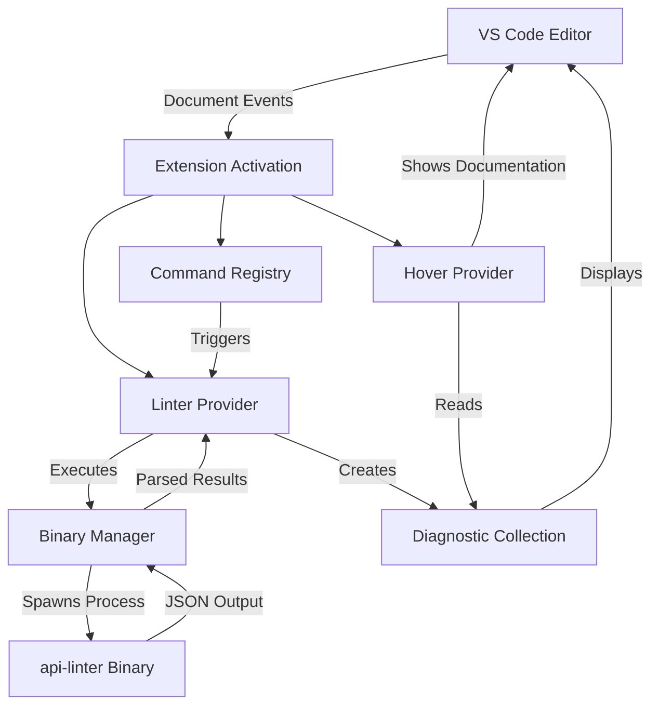
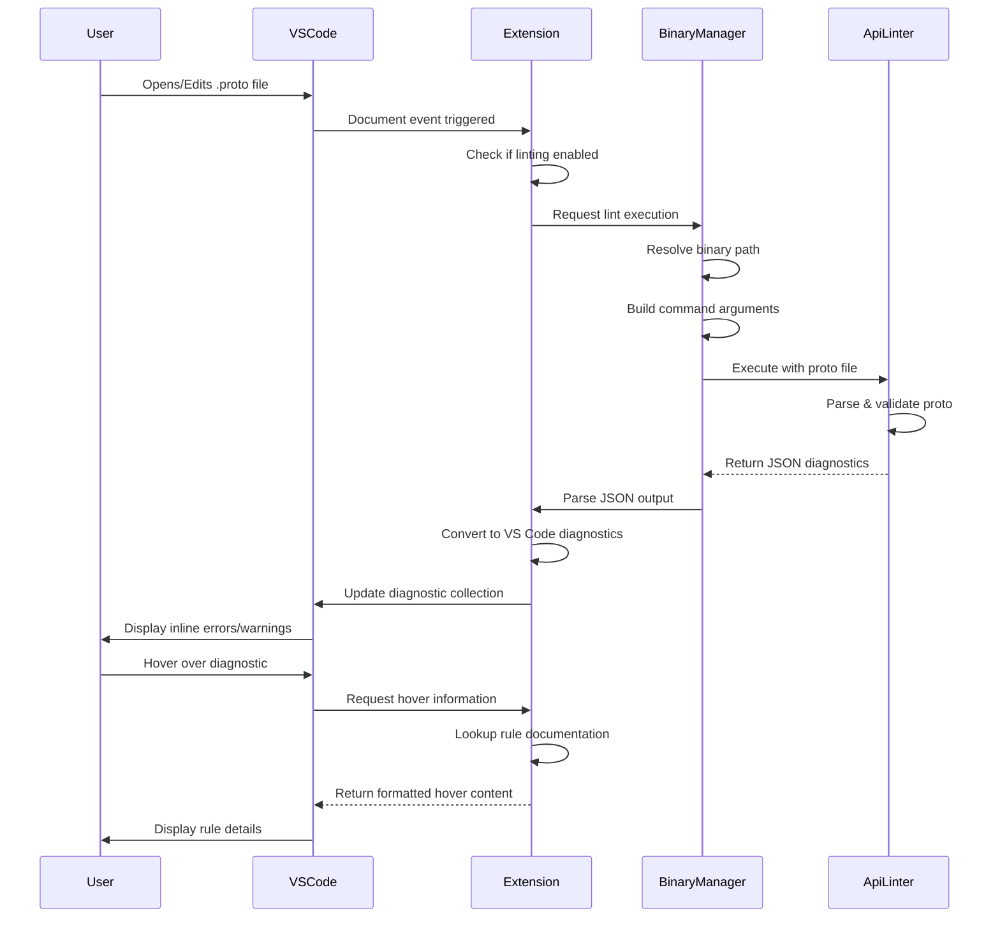

# Google API Linter for VS Code

<!-- markdownlint-disable MD041 -->
<!-- markdownlint-disable MD033 MD013 -->

<p align="center">
  
</p>

<p align="center">
  <strong>Google API Linter for VS Code</strong><br>
  Real-time linting, diagnostics, and inline guidance for Protocol Buffers<br>
  based on the <a href="https://cloud.google.com/apis/design">Google API Design Guidelines</a>
</p>

<!-- markdownlint-enable MD033 MD013 -->

## Features

### Linting & diagnostics
- **Real-time Linting**: Automatically validates `.proto` files as you type or save
- **Inline Diagnostics**: Displays linting errors and warnings directly in the editor
- **Hover Documentation**: Shows detailed rule information when hovering over diagnostics
- **Proto View (Activity Bar)**: Debugger-style sidebar with **Lint**, **Format**, **Reload**; **Report Issue** (GitHub icon) opens a pre-filled bug issue on GitHub; **Services** (expand to RPCs, then Request/Response—click to go to type in file); **Resources**; **MCP** (Tools, Elicitation, Prompts); **Messages** (expand for fields and enums); **Enums**; **Deps** (googleapis, protobuf); **Files** with pastel status (cyan=OK, magenta=warning, blue=error). **Collapse All** in the title bar. Click any item to jump to that symbol or type in the file. Right‑click a file to **Lint** or **Format** that file.
- **Status Bar**: Shows "Proto" or "Proto: X error(s), Y warning(s)"; click to open the Proto view
- **Config File Validation**: Warnings for unknown keys and invalid paths in `.api-linter.yaml` and `workspace.protobuf.yaml`

### Editor support
- **Syntax Highlighting**: Full Protocol Buffers syntax highlighting with TextMate grammar
- **IntelliSense**: Completions, signature help, and hover for messages, services, RPCs, options (`google.api.http`, `google.api.resource`, `mcp.protobuf.*`), and keywords
- **Import Path Completion**: After `import "`, suggests `.proto` paths from the workspace and configured proto paths
- **Format Document**: Format `.proto` files with **buf format** (if `buf` is installed), **clang-format**, or a built-in **simple** indent; **`gapi.formatOnSave`** formats the **buffer** on save (see Troubleshooting if you also use Editor: Format On Save)
- **Code Snippets**: Snippets for proto3, messages, services, RPCs, HTTP/resource options, MCP options, and a full **resource + service** (`resourceservice`) that generates a `_service.proto` with a resource message and List/Get/Create/Update/Delete RPCs
- **Document Links**: Clickable `import "path/to/file.proto"` links that open the imported file
- **Go to Definition / Find References**: Navigate to message, enum, and service definitions and find all references
- **Rename Symbol**: Rename messages, services, enums, and RPCs with updates across the workspace
- **Code Actions (Quick Fixes)**: Add `(google.api.http)` for RPCs, `(google.api.resource)` for messages, and `_UNSPECIFIED = 0` for enums
- **Outline & Folding**: Document symbols and folding ranges for messages, services, enums, and oneofs

### Workspace & setup
- **Automatic Binary Management**: Downloads and updates api-linter binary automatically
- **Automatic googleapis Integration**: Downloads googleapis protos on first use - no configuration needed
- **Smart Proto Path Detection**: Uses `workspace.protobuf.yaml`, **buf.yaml** (modules + deps), and settings for proto paths
- **buf.yaml support**: When `buf.yaml` is present, the extension runs `buf mod download` and `buf export` so linting resolves all **deps** (e.g. `buf.build/googleapis/googleapis`, `buf.build/the-protobuf-project/grpc-mcp-gateway`) and local **modules**; no manual proto paths needed for Buf dependencies
- **Protobuf folder as root**: If your protos live under a folder named `protobuf/`, that directory is used as the import root so `import "store/info/v1/category.proto"` resolves to `protobuf/store/info/v1/category.proto`; linting works from any subfolder
- **.api-linter.yaml auto-discovery**: If you don’t set `gapi.configPath`, the extension finds `.api-linter.yaml` by walking up from the current file to the workspace root, so the config is used even when editing files in subfolders
- **Workspace Linting**: Lint all proto files in your workspace with a single command
- **Initialize Proto Workspace**: Create `workspace.protobuf.yaml` from the Proto view; in multi-root workspaces, init is available per folder
- **Multi-Root Workspaces**: Proto view and init are scoped per workspace folder when multiple roots are open
- **Update Notifications**: Prompts when new api-linter versions are available
- **Configurable Rules**: Enable or disable specific linting rules via configuration
- **Cross-Platform**: Works on Windows, macOS, and Linux

## Troubleshooting

- **Imports / go-to-definition until reload**: The extension resolves imports using the same roots as linting (`workspace.protobuf.yaml`, **buf export**, `gapi.protoPath`, `~/.gapi`). After changing **buf.yaml** or **buf.lock**, paths refresh automatically; if something still looks stale, run **Developer: Reload Window**.
- **Double format on save**: With **`gapi.formatOnSave`** enabled, the extension formats in **will save** from the **in-memory** buffer (so buf matches unsaved edits). If you also use **Editor: Format On Save**, VS Code may run a second format pass; disable one of them if that is unwanted.
- **Buf / api-linter not found**: Set **`gapi.bufPath`** and **`gapi.binaryPath`** to absolute paths if they are not on `PATH`. The first run may download deps into `~/.gapi` (needs network).
- **Rapid saves and lint**: If you save twice very quickly, the linter **re-runs** after the first pass finishes so the latest file state is still covered.
- **Verbose linter logs**: Set **`gapi.debugLintLogging`** to `true` to print full applied settings on **every** lint; default logs settings only when they change.

## Architecture

The extension operates through a multi-layered architecture that integrates the `api-linter` binary with VS Code's diagnostic system.



## How It Works

### Workflow Overview



### Component Breakdown

#### 1. Extension Activation
When a `.proto` file is opened or the extension starts:
- Registers diagnostic collection for displaying linting results
- Creates output channel for logging
- Initializes linter and hover providers
- Registers commands and document event listeners

#### 2. Binary Manager
Manages the `api-linter` binary and googleapis:
- Automatically downloads api-linter binary to `~/.gapi/` on first use
- Automatically downloads googleapis from GitHub
- Checks for updates every 10 days and prompts user
- Constructs command-line arguments from configuration
- Handles process spawning and output streaming
- Parses JSON output into structured diagnostics

#### 3. Linter Provider
Core linting logic:
- Receives document change events
- Invokes binary manager with current file
- Transforms linter output to VS Code diagnostics
- Updates diagnostic collection with results

#### 4. Hover Provider
Provides contextual information:
- Detects when user hovers over a diagnostic
- Retrieves rule documentation from diagnostic metadata
- Formats and displays rule details in hover tooltip

## Installation

### Prerequisites

**None!** The extension automatically downloads and manages the `api-linter` binary and googleapis protos for you.

### Extension Installation

1. **From VS Code Marketplace**
   - Open VS Code
   - Go to Extensions (Cmd+Shift+X / Ctrl+Shift+X)
   - Search for "Google API Linter"
   - Click Install

2. **From VSIX File**
   ```bash
   code --install-extension google-api-linter-1.0.0.vsix
   ```

## Configuration

Configure the extension through VS Code settings (File > Preferences > Settings or `Cmd+,`):

### Available Settings

| Setting | Type | Default | Description |
|---------|------|---------|-------------|
| `gapi.binaryPath` | string | `"api-linter"` | Path to the api-linter binary |
| `gapi.formatOnSave` | boolean | `true` | Format proto files when you save |
| `gapi.formatter` | string | `"buf"` | Formatter: `buf`, `clang-format`, or `simple` (built-in indent) |
| `gapi.clangFormatPath` | string | `"clang-format"` | Path to clang-format when using `gapi.formatter: "clang-format"` |
| `gapi.enableOnSave` | boolean | `true` | Run linter when saving proto files |
| `gapi.enableOnType` | boolean | `false` | Run linter while typing (may impact performance) |
| `gapi.configPath` | string | `""` | Path to `.api-linter.yaml` configuration file |
| `gapi.protoPath` | array | `[]` | Additional proto import paths |
| `gapi.disableRules` | array | `[]` | Rules to disable (e.g., `["core::0192::has-comments"]`) |
| `gapi.enableRules` | array | `[]` | Rules to explicitly enable |
| `gapi.descriptorSetIn` | array | `[]` | FileDescriptorSet files for imports |
| `gapi.ignoreCommentDisables` | boolean | `false` | Ignore disable comments in proto files |
| `gapi.setExitStatus` | boolean | `false` | Return exit status 1 on lint errors |
| `gapi.rulesDocumentationEndpoint` | string | `"https://linter.aip.dev"` | Base URL for rule documentation (use `http://localhost:8080` for local development) |

### Example Configuration

```json
{
  "gapi.binaryPath": "/usr/local/bin/api-linter",
  "gapi.enableOnSave": true,
  "gapi.enableOnType": false,
  "gapi.protoPath": [
    "${workspaceFolder}/proto",
    "${workspaceFolder}/third_party/googleapis"
  ],
  "gapi.disableRules": [
    "core::0192::has-comments"
  ],
  "gapi.rulesDocumentationEndpoint": "https://linter.aip.dev"
}
```

### Local Development with Custom Documentation

For local development or testing with a local documentation server:

```json
{
  "gapi.rulesDocumentationEndpoint": "http://localhost:8080"
}
```

This will redirect all rule documentation links to your local server instead of the official https://linter.aip.dev site.

### Self-Hosting Documentation for Larger Teams

> [!WARNING]
> If you're using this extension with a larger team, it's **highly recommended** to host your own documentation server to avoid rate limits on the public https://linter.aip.dev site.

The official api-linter documentation is available at:
- **Documentation Source**: https://github.com/googleapis/api-linter/tree/main/docs
- **Self-Hosting Guide**: https://github.com/googleapis/api-linter#documentation

#### Why Self-Host?

- **Rate Limits**: The public documentation site has rate limits that may be exceeded by teams
- **Reliability**: Your own server ensures consistent availability
- **Customization**: Add custom rules and documentation specific to your organization
- **Performance**: Faster response times for your team

#### Setup Example

1. Clone and build the api-linter documentation
2. Host it on your internal server (e.g., `https://docs.internal.company.com/api-linter`)
3. Configure the extension:

```json
{
  "gapi.rulesDocumentationEndpoint": "https://docs.internal.company.com/api-linter"
}
```

### Workspace Configuration

For project-specific settings, create `.vscode/settings.json`:

```json
{
  "gapi.configPath": "${workspaceFolder}/.api-linter.yaml",
  "gapi.protoPath": [
    "${workspaceFolder}/protobuf",
    "${workspaceFolder}/third_party"
  ]
}
```

You can omit `gapi.configPath` if `.api-linter.yaml` is at the workspace root; the extension will discover it automatically when linting from any folder.

## Usage

### Proto View (Activity Bar)

Click the **Proto** icon in the Activity Bar to open the API Linter view (Run-and-Debug style layout):

- **Top**: Action buttons—**Lint All Proto Files**, **Lint Current File**, **Create Config File**, **Initialize Proto Workspace**, **Restart**
- **RPCs** (expandable): All RPC methods in services
- **Resources** (expandable): Messages with `google.api.resource`
- **Messages** (expandable): All proto messages
- **MCP** (expandable): MCP options (service, tool, prompt, elicitation)
- **Others** (expandable): Enums and other definitions (flat list)
- **API Linter** status and workspace **proto files** with error/warning counts; expand a file to see each diagnostic

**Hover** any RPC, resource, message, MCP item, or enum to see its documentation snippet (leading comment from the proto file). Click any item to jump to its definition.

The extension activates when a `.proto` file is present or when `workspace.protobuf.yaml` exists in the workspace.

### Commands

Access commands via Command Palette (Cmd+Shift+P / Ctrl+Shift+P):

- **Google API Linter: Lint Current File** - Lint the currently open proto file
- **Google API Linter: Lint All Proto Files in Workspace** - Lint all `.proto` files in workspace
- **Google API Linter: Create Config File** - Generate a `.api-linter.yaml` template
- **Google API Linter: Initialize Proto Workspace** - Create `workspace.protobuf.yaml` in the workspace (or in the chosen folder for multi-root)
- **Google API Linter: Update googleapis Commit** - Download specific googleapis commit to workspace `.gapi/`
- **Google API Linter: Restart** - Restart the linter (useful after config changes)
- **Google API Linter: Refresh Proto View** - Refresh the Proto tree view

**Formatting**: Proto files are formatted automatically when you save (if `gapi.formatOnSave` is true). Choose the formatter with `gapi.formatter`: **buf** ([Buf format](https://buf.build/docs/format/)), **clang-format** ([ClangFormat for Protobuf](https://clang.llvm.org/docs/ClangFormat.html)), or **simple** (built-in indent). You can also use **Format Document** (or your format shortcut) anytime.

### Automatic Linting

By default, the extension lints proto files:
- When opening a proto file
- When saving a proto file (if `gapi.enableOnSave` is true)
- When typing (if `gapi.enableOnType` is true, with 1-second debounce and auto-save)

### Viewing Diagnostics

Linting results appear:
- **Inline**: Squiggly underlines in the editor
- **Problems Panel**: View > Problems (Cmd+Shift+M / Ctrl+Shift+M)
- **Proto View**: Expand a file in the Proto panel to see each diagnostic; click to go to that line
- **Status Bar**: "Proto" or "Proto: X error(s), Y warning(s)"—click to focus the Proto view
- **Hover**: Hover over underlined code to see rule details

## API Linter Configuration

Create a `.api-linter.yaml` file in your project root to configure linting rules:

```yaml
# Disable specific rules
disabled_rules:
  - core::0192::has-comments
  - core::0203::optional

# Enable specific rules
enabled_rules:
  - core::0140::prepositions

# Additional proto import paths
proto_paths:
  - ./proto
  - ./third_party
```

The extension validates this file and `workspace.protobuf.yaml`: it reports **unknown keys** and **invalid paths** (e.g. non-existent `proto_paths` entries) as warnings in the editor.

Refer to the [api-linter documentation](https://linter.aip.dev/) for available rules and configuration options.

### Proto workspace config (`workspace.protobuf.yaml`)

Optional. Create this file (e.g. via **Initialize Proto Workspace** from the Proto view) to enable the extension and set proto paths for the workspace:

```yaml
# Optional: list of directories containing .proto files (default: this directory)
proto_path: .
```

In **multi-root workspaces**, each folder can have its own `workspace.protobuf.yaml`; the Proto view shows one section per folder and offers init per folder when the config is missing.

### buf.yaml (Buf build)

If your project uses [Buf](https://buf.build/) with a `buf.yaml` at the workspace root (or next to your protos), the extension will:

- Read **modules** (e.g. `path: protobuf`, `name: buf.build/the-protobuf-project/protoverse`) and **deps** (e.g. `buf.build/googleapis/googleapis`, `buf.build/the-protobuf-project/grpc-mcp-gateway`)
- Run `buf mod download` and `buf export` so the api-linter can resolve all imports when linting
- Use the exported tree and local module paths as proto paths (cached for 5 minutes)

Ensure `buf` is on your PATH. If `buf` is not installed or export fails, the extension falls back to other proto paths (`workspace.protobuf.yaml`, `gapi.protoPath`, and the `protobuf` folder root).

### Proto layout with a `protobuf` folder

A common layout is to put all protos under a single root folder (e.g. `protobuf/`) so imports are consistent:

```
your-repo/
├── .api-linter.yaml
├── workspace.protobuf.yaml    # proto_path: protobuf
├── buf.yaml                    # optional; deps + modules
└── protobuf/
    ├── store/
    │   └── info/
    │       └── v1/
    │           └── category.proto
    └── info/
        └── v1/
            └── ...
```

- In `workspace.protobuf.yaml` set `proto_path: protobuf` (or `proto_path: .` if the config file is inside `protobuf/`).
- Then `import "store/info/v1/category.proto"` resolves to `protobuf/store/info/v1/category.proto`.
- The extension automatically adds the `protobuf` directory as a proto path when the file you’re editing is under a folder named `protobuf`, so linting works from any subfolder and `.api-linter.yaml` at the repo root is still found.

## Troubleshooting

### Binary Not Found

**Error**: `api-linter binary not found`

**Solution**:
The extension automatically downloads the binary on first use. If you see this error:
1. Check your internet connection
2. Ensure `~/.gapi/` directory is writable
3. Alternatively, set `gapi.binaryPath` to a custom binary location

### Import Errors

**Error**: `Import "google/api/annotations.proto" was not found`

**Solution**:
The extension automatically downloads googleapis on first use. If imports still fail:
1. Check that `~/.gapi/googleapis/` exists and contains proto files
2. For workspace-specific googleapis version, run: **Google API Linter: Update googleapis Commit**
3. Manually add proto paths if needed:
   ```json
   {
     "gapi.protoPath": ["${workspaceFolder}/.gapi/googleapis"]
   }
   ```

### Performance Issues

If linting is slow or causes lag:
1. Disable `gapi.enableOnType` (keep `gapi.enableOnSave` enabled)
2. The extension uses 1-second debouncing for on-type linting to minimize performance impact
3. Use `.api-linter.yaml` to disable expensive rules
4. Exclude large proto files or directories

## Development

### Building from Source

```bash
# Clone repository
git clone https://github.com/the-protobuf-project/google-api-linter-vscode.git
cd google-api-linter-vscode

# Install dependencies
bun install

# Compile TypeScript
bun run compile

# Package extension
bun run package

# Install locally
code --install-extension google-api-linter-1.0.0.vsix
```

### Publishing to the Marketplace

Push a tag to create a release and publish automatically:

```bash
git tag v1.2.0
git push origin v1.2.0
```

The [Release workflow](.github/workflows/release.yaml) builds the extension, creates the GitHub release with commit-based release notes and the `.vsix` asset, and **publishes to the VS Code Marketplace** (if the `VSCE_PAT` secret is set). Add `VSCE_PAT` as described in [.github/SECRETS.md](.github/SECRETS.md).

### Project Structure

```
vscode-googleapi-linter/
├── src/
│   ├── extension.ts           # Extension entry point
│   ├── linterProvider.ts      # Core linting logic
│   ├── binaryManager.ts       # Binary execution handler
│   ├── hoverProvider.ts       # Hover documentation
│   ├── commands.ts            # Command implementations
│   ├── constants.ts           # Shared constants
│   ├── types.ts               # TypeScript type definitions
│   ├── protoView.ts           # Proto activity bar view (RPCs, resources, MCP, diagnostics)
│   ├── statusBar.ts           # Status bar item
│   ├── formatProvider.ts      # Format document (buf / simple formatter)
│   ├── configValidator.ts     # Validation for .api-linter.yaml and workspace.protobuf.yaml
│   ├── completionProvider.ts # IntelliSense and import path completion
│   ├── signatureHelpProvider.ts
│   ├── documentSymbolProvider.ts
│   ├── workspaceSymbolProvider.ts
│   ├── definitionProvider.ts
│   ├── referenceProvider.ts
│   ├── renameProvider.ts
│   ├── codeActionProvider.ts
│   ├── documentLinkProvider.ts
│   ├── foldingProvider.ts
│   ├── symbolHoverProvider.ts
│   ├── protoScanner.ts        # Scan workspace for RPCs, resources, MCP
│   └── utils/                 # fileUtils, configReader, bufConfigReader, protoParser, linterUtils, etc.
├── snippets/
│   └── proto3.json            # Proto3, MCP, and resource+service (CRUD) snippets
├── package.json               # Extension manifest
├── tsconfig.json              # TypeScript configuration
└── .github/
    └── workflows/
        └── release.yaml       # CI/CD pipeline
```

## Contributing

Contributions are welcome! Please follow these guidelines:

1. Fork the repository
2. Create a feature branch: `git checkout -b feature/your-feature`
3. Make your changes with clear commit messages
4. Add tests if applicable
5. Submit a pull request

## License

This project is licensed under the Apache License 2.0. See [LICENSE.md](LICENSE.md) for details.

## Resources

- [Google API Linter](https://github.com/googleapis/api-linter)
- [Google API Design Guide](https://cloud.google.com/apis/design)
- [API Improvement Proposals (AIPs)](https://google.aip.dev/)
- [Protocol Buffers](https://protobuf.dev/)

## Support

- **Issues**: [GitHub Issues](https://github.com/the-protobuf-project/google-api-linter-vscode/issues)
- **Discussions**: [GitHub Discussions](https://github.com/the-protobuf-project/google-api-linter-vscode/discussions)

---

**The Protobuf Project** | [GitHub](https://github.com/the-protobuf-project) | [Website](https://the-protobuf-project.com)
